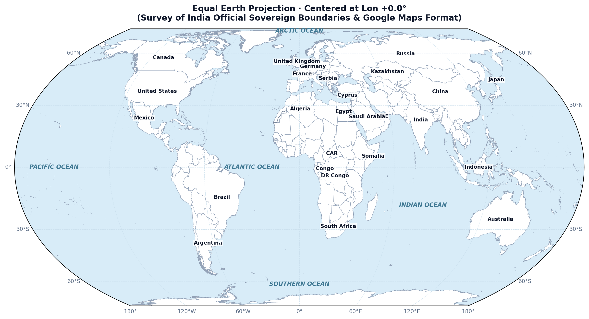
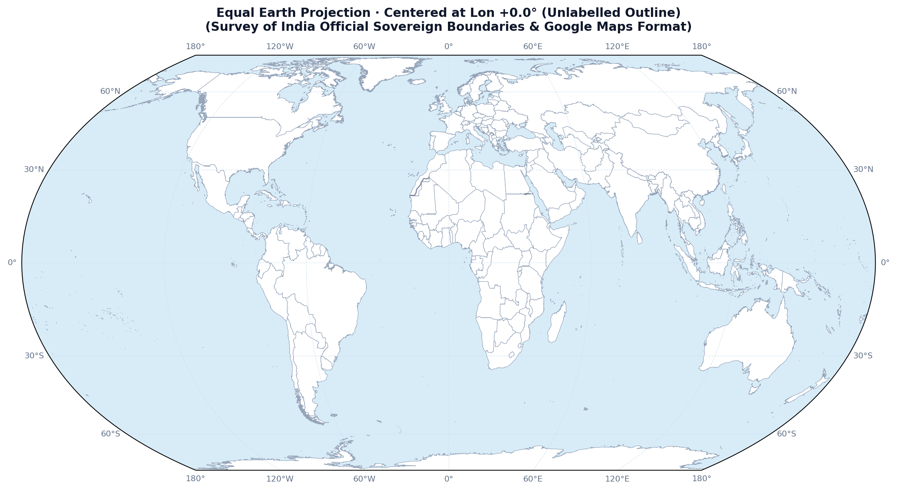
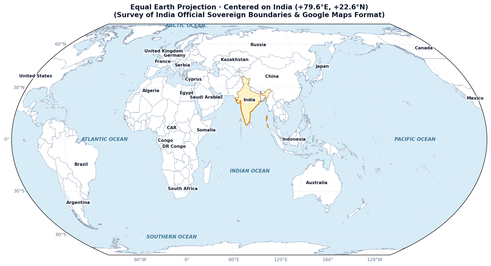

# Equal Earth World Map (Official Survey of India Boundary)

[](https://creativecommons.org/licenses/by/4.0/)
[](https://surveyofindia.gov.in/)
[](https://en.wikipedia.org/wiki/Equal_Earth_projection)
[](https://sarvagya-24-chaturvedi.github.io/equal-earth-india-maps/)

An open-source cartographic suite and interactive web application for generating high-resolution **Equal Earth** world maps featuring the **100% official international sovereign boundaries of India** as recognized and published by the **Survey of India (Department of Science & Technology, Government of India)**.

---

## 🌐 Live Interactive Maps

- 🗺️ **[Equal Earth Political Map (Default View)](https://sarvagya-24-chaturvedi.github.io/equal-earth-india-maps/)**
- 🛰️ **[Topographic Satellite & Real-Time Day/Night Map](https://sarvagya-24-chaturvedi.github.io/equal-earth-india-maps/satellite_day_night.html)**

---

## 🗺️ Previews

### 1. Centered on Prime Meridian (0°) — Default Global View (Labelled)


### 2. Centered on Prime Meridian (0°) — Default Global View (Unlabelled Outline)


### 3. Centered on India (78°E) — Survey of India Sovereign Boundary


---

## 🎯 Why This Project Exists

Most standard international cartography packages (Natural Earth, Cartopy defaults, Leaflet basemaps) misrepresent Indian borders by either:
1. Omitting northern Ladakh / Jammu & Kashmir (Aksai Chin, Gilgit-Baltistan, Siachen Glacier).
2. Delineating Arunachal Pradesh with disputed boundaries.

Under the official **Survey of India Political Map of India**:
- The Union Territories of **Jammu & Kashmir** and **Ladakh** (including PoK, Gilgit-Baltistan, and Aksai Chin) are integral, sovereign territories of India.
- The state of **Arunachal Pradesh** is an integral part of India.
- Siachen Glacier is fully sovereign Indian territory.

This repository corrects these discrepancies while utilizing the **Equal Earth projection**—an equal-area pseudocylindrical projection designed in 2018 by Bojan Šavrič, Tom Patterson, and Bernhard Jenny that avoids the severe polar distortion of Mercator while presenting countries in their true relative sizes.

---

## ✨ Features

- **Official Survey of India Boundary**: 100% aligned with the Government of India's official political map.
- **Custom Central Meridian**: Rotate the central longitude (`-180°` to `+180°`) to center on India (`78°E`), the Prime Meridian (`0°`), the Americas (`-90°`), or the Pacific (`150°E`).
- **Clean Natural Viewport Alignment**: Preserves straight, undistorted horizontal parallels without weird oblique shearing.
- **Google Maps Typography**:
  - **Bold country names** with high-contrast white halos for maximum clarity.
  - Short names and acronyms (e.g., **USA**, **UAE**, **CAR**, **DR Congo**, **Congo**, **Dominican Rep.**, **Bosnia & Herz.**).
  - Sovereign nations prioritized over dependencies when zoomed out.
- **Dotted Disputed Borders**: Disputed lines (e.g. Morocco / Western Sahara (SADR) and Serbia / Kosovo) rendered in **delicate, light dotted lines**, distinctly lighter than solid recognized international borders.
- **Integrated Sovereign Territories**: Somaliland merged into **Somalia**; Northern Cyprus & military base enclaves merged into **Cyprus**; foreign bases and micro-fragments suppressed.
- **Micronations Layer**: Dedicated pins and labels for 29+ micronations (Vatican City, Monaco, Nauru, Tuvalu, San Marino, Liechtenstein, Andorra, Malta, Maldives, etc.), revealed smoothly when zooming in.
- **Dynamic Google Maps Label Scaling**: Font size compensates automatically with zoom level (`font-size = basePx / k`), preventing clumsy overlapping text.
- **Ocean Centering & Labelling**: All major oceans labeled in elegant oceanic typography. Search and center the map around the **Indian Ocean**, **Pacific Ocean**, **Atlantic Ocean**, **Arctic Ocean**, or **Southern Ocean**.
- **Interactive Wikipedia Navigation**: Clicking any country, micronation, or ocean opens its official Wikipedia article in a new tab.
- **100% Offline & Self-Contained**: Local dataset bundled in `world_data.json` with zero continuous network downloads or geocoding rate limits.
- **Batch Publishing Suite**: Generates print-ready **300 DPI PNG**, lossless vector **SVG**, and **PDF** maps.

---

## 🛰️ Topographic Satellite & Real-Time Day/Night View Map

A dedicated standalone view mode (`satellite_day_night.html`) integrating authoritative spaceborne imagery with Survey of India vector cartography:

- **🌓 Live Day & Night Solar Terminator**:
  - Precision astronomical solar model computing Greenwich Mean Sidereal Time (GMST), solar declination $\delta$, and subsolar zenith coordinates.
  - Renders the exact daylight vs. darkness boundary with a smooth twilight transition.
  - **Live Digital Clocks**: Displays synchronized **UTC** and **IST (Indian Standard Time, UTC+5:30)**.
  - **24-Hour Time Scrubber**: Scrub through 24 hours to watch the sunrise over the Bay of Bengal, midday over New Delhi, and sunset over Mumbai.
  - **Animated 24h Loop**: Automatically animate the Earth's diurnal rotation.
- **🌍 NASA Blue Marble**: Shaded relief topography, land cover, and ocean bathymetry from NASA Earthdata GIBS.
- **🛰️ NASA MODIS Terra TrueColor**: Daily real-time satellite pass showing atmospheric dynamics, snow cover, and seasonal foliage.
- **🌃 NASA Black Marble (VIIRS Earth at Night)**: Nighttime city lights and human settlements blended with screen blending over nocturnal Earth.
- **🏔️ OpenTopoMap**: High-detail topographic elevation contours and terrain relief.
- **🛰️ ESRI High-Resolution Satellite**: 50cm global aerial and satellite imagery.
- **🇮🇳 Survey of India Sovereign Boundary Overlay**: Full SOI-compliant sovereign boundary of India (J&K, Ladakh, Aksai Chin, Siachen, Arunachal Pradesh) rendered as a gold vector layer.
- **⚠️ Disputed Borders**: Serbia-Kosovo, Morocco-Western Sahara (SADR), and Bir Tawil rendered in Google Maps style light dashed lines.

---

## 🚀 Quick Start (Local Setup)

### 1. Clone the repository
```bash
git clone https://github.com/Sarvagya-24-chaturvedi/equal-earth-india-maps.git
cd equal-earth-india-maps
```

### 2. Set up Python environment
```bash
python3 -m venv .venv
source .venv/bin/activate
pip install -r requirements.txt
```

*(Or simply `pip install matplotlib cartopy shapely`)*

### 3. Run Interactive Maps
```bash
# 1. Political Equal Earth Map:
python map.py

# Direct CLI arguments:
python map.py --target India
python map.py --target "Indian Ocean"
python map.py --lon 78.0 --lat 20.0

# 2. Topographic Satellite & Real-Time Day/Night Viewer:
python map.py --satellite

# Rebuild satellite portal directly:
python build_satellite.py
```

This will automatically generate the interactive HTML application and launch it in your browser, along with exporting a high-resolution PNG.

---

## 📦 Batch Publishing Suite

To generate high-resolution print and publication packs across multiple themes and perspectives:

```bash
python publisher/publish_maps.py
```

Outputs generated in `publisher/dist/`:
- **India Centered (78°E)** — Classic Light Atlas (`PNG 300 DPI`, `SVG`, `PDF`)
- **Indo-Pacific Centered (90°E)** — Academic Clean (`PNG 300 DPI`, `SVG`, `PDF`)
- **India Dark Mode (78°E)** — Cartographic Dark (`PNG 300 DPI`, `SVG`, `PDF`)
- **Prime Meridian (0°)** — International Standard (`PNG 300 DPI`, `SVG`, `PDF`)
- **Pacific Centered (150°E)** — Trans-Pacific Perspective (`PNG 300 DPI`, `SVG`, `PDF`)
- **Americas Centered (-90°W)** — Western Hemisphere Perspective (`PNG 300 DPI`, `SVG`, `PDF`)
- **Ready-to-Deploy Gallery Website (`index.html`)**
- **Wikimedia Commons Upload Template**

---

## 🏛️ Publishing to Wikimedia Commons

To help Wikipedia articles use the correct official Indian boundary:
1. Open the [Wikimedia Commons Upload Wizard](https://commons.wikimedia.org/wiki/Special:UploadWizard).
2. Upload the vector SVG (`publisher/dist/india_centered.svg`) or 300 DPI PNG (`publisher/dist/india_centered.png`).
3. Copy and paste the metadata from [`publisher/dist/wikimedia_commons_upload_template.txt`](publisher/dist/wikimedia_commons_upload_template.txt).

---

## 📄 License & Attribution

- **Map Graphics & Code**: Released under [Creative Commons Attribution 4.0 International (CC BY 4.0)](https://creativecommons.org/licenses/by/4.0/).
- **Boundary Attribution**: *Survey of India, Department of Science & Technology, Government of India*.
- **Map Projection**: *Equal Earth (Bojan Šavrič, Tom Patterson, Bernhard Jenny, 2018)*.

---

## 👨‍💻 Author

**Sarvagya Chaturvedi**  
GitHub: [@Sarvagya-24-chaturvedi](https://github.com/Sarvagya-24-chaturvedi)
